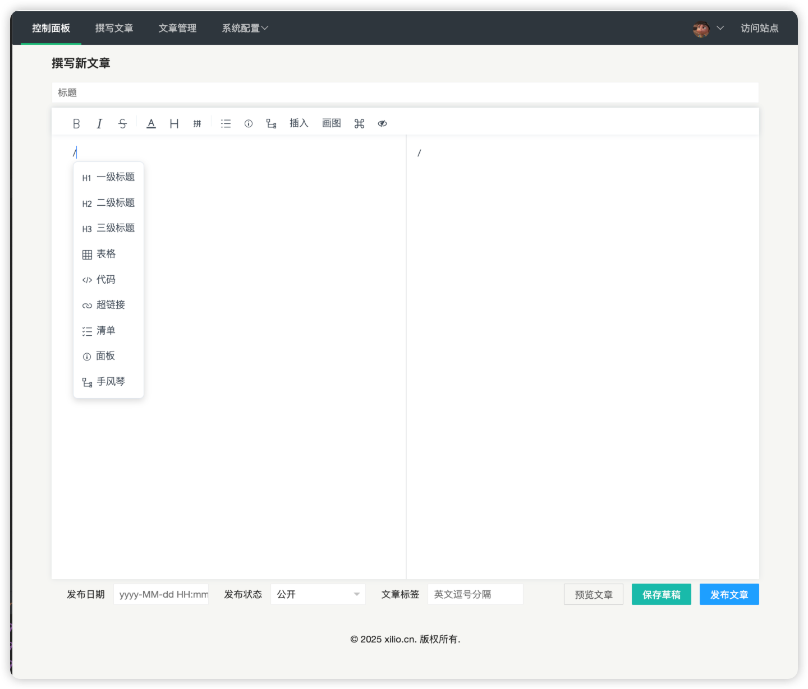

# 📒TinyNote

### ℹ️简介
一款轻量级写作软件，遵循大道至简设计思想，界面设计简洁，操作简单。

### 🧵线上体验地址
- 🆚前端预览：http://www.xilio.cn
### 🔧功能清单
- 🖥️双屏写作，实时预览，编辑器美观
- 📄复制页面内容自动转markdown格式
- 🦟每篇文章独立SEO，利于被搜索引擎发现
- 🀄️复制粘贴自动上传文章图片
- 🤖绘制各种常用UML图
- 🌲发布日期自定义可修改
- 🗑️文章草稿箱
- 🧑‍💻多种状态发布（隐私发布文章对登陆管理员无限制）
- 🏷️文章标签，支持创建多个标签
- 🪪批量标记文章公开
- ⬆️批量标记文章私密
- ⛰️批量删除文章
- 🫗文章列表打印为pdf表格、导出csv
- 🎵文章内容导出pdf格式
- 🏃网站信息配置
- 🔐登陆认证

### 🚀快速开始
> 环境要求：
> - jdk17版本及以上
> - mysql 5.7及以上版本
> - maven

1、将发布版本的源码下载到本地，将resources目录下的数据库脚本[schema-mysql.sql](src/main/resources/db/schema-mysql.sql)导入到自己的mysql中。

2、修改配置文件[application-prod.yml](src/main/resources/application-prod.yml)，将数据库名、用户密码改为自己的。

3、点击[Application](src/main/java/cn/xilio/tinynote/Application.java)启动项目。

4、启动后默认后台管理用户密码是[admin:123456]，可以登陆系统后自行修改。

- 网站首页访问地址：http://localhost:8080
- 后台管理：http://localhost:8080/admin/login (admin: 123456)

### 🙋问题反馈
报告 issue: [github issues](https://github.com/xiaoniucode/tinynote/issues)
