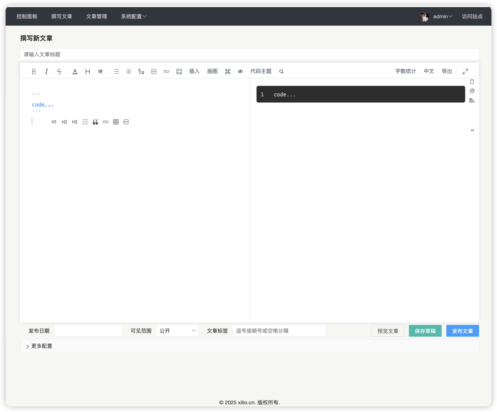

# TinyNote 
一款轻量级写作软件，遵循大道至简设计思想，引入优质的对写作者友好的markdown的编辑器。

## 功能清单
- 双屏写作，实时预览，编辑器美观，功能强大
- 复制页面内容自动转markdown格式
- 每篇文章独立SEO，利于被搜索引擎发现
- 复制粘贴自动上传文章图片
- 绘制各种常用UML图
- 发布日期自定义可修改
- 文章草稿箱
- 多种状态发布（隐私发布文章对登陆管理员无限制）
- 文章标签，支持创建多个标签
- 批量标记文章公开
- 批量标记文章私密
- 批量删除文章
- 文章列表打印为pdf表格、导出csv
- 文章内容导出pdf格式
- 网站信息配置
- 登陆认证

## 项目亮点

- 轻量级，只提供最核心的功能，没有烦杂可能不常用的功能，大幅度节省服务资源。
- 编辑器写作和预览体验及佳，集成和定制腾讯cherry-markdown，提供丰富的写作体验。
- 界面整体布局调色优雅美观，护眼，操作简单舒适
